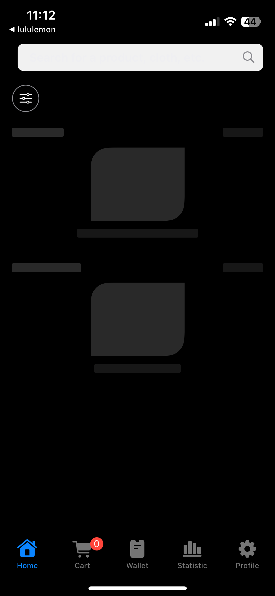
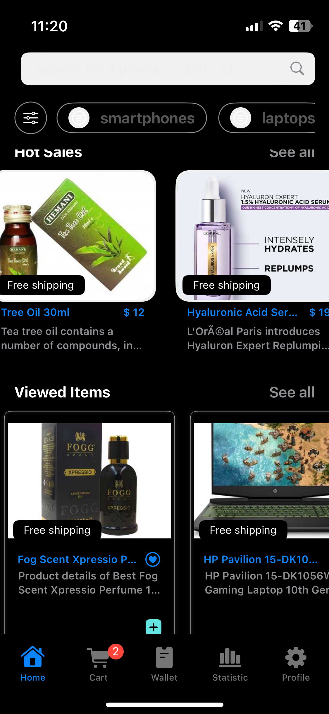
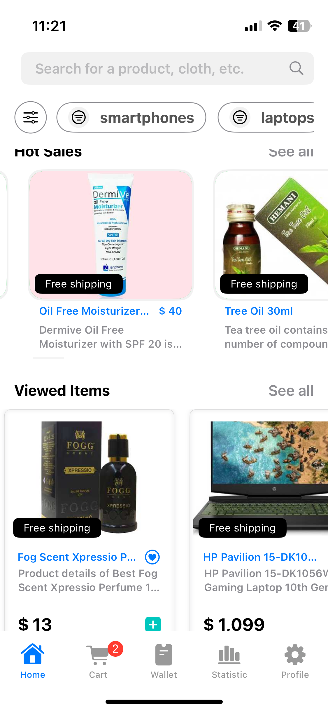
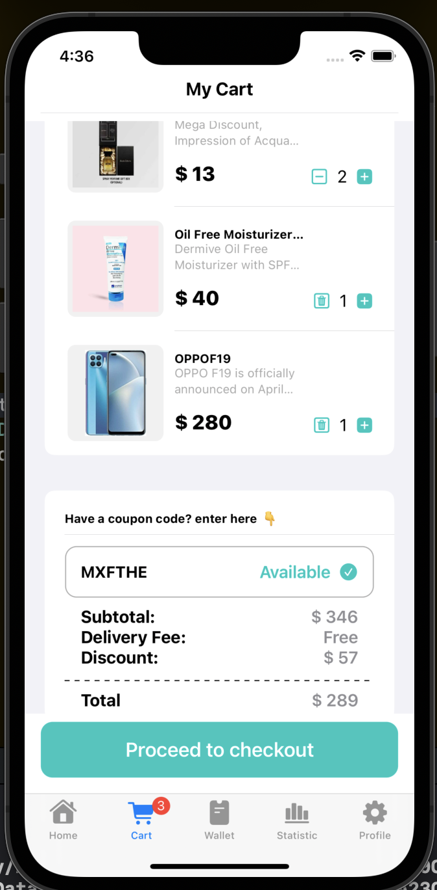
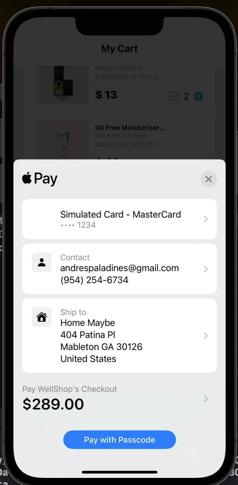
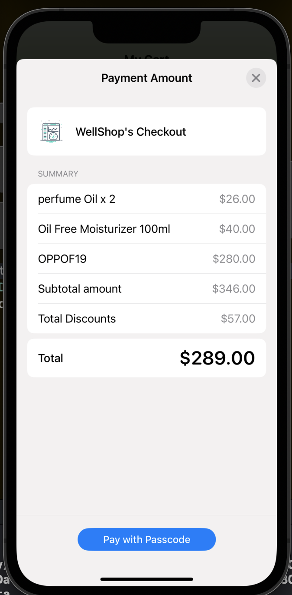
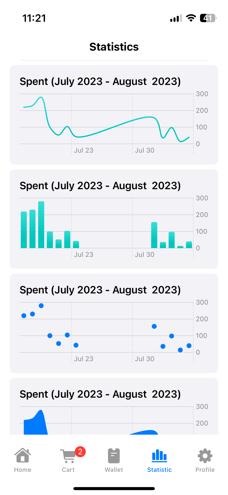
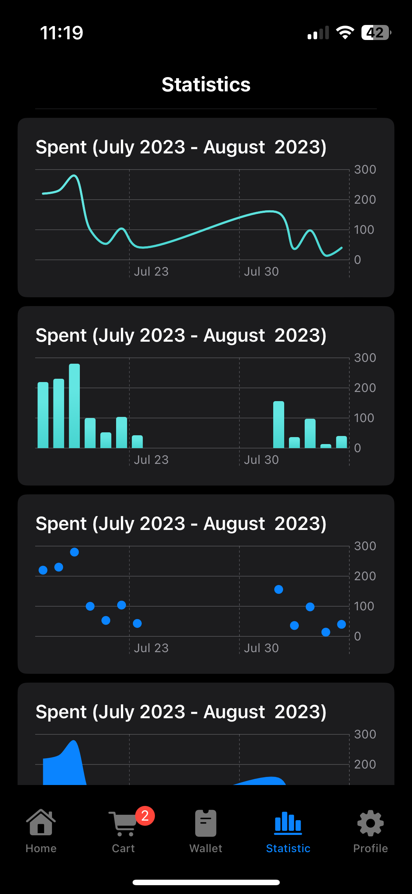

# The Sounds Store
Apple Payments
## Author: Andres D. Paladines

[![License][license-image]][license-url] [![Swift Version][swift-image]][swift-url] [![SwiftUI][swiftUI-image]][swiftUI-url] 

[swift-image]:https://img.shields.io/badge/Swift-5.8.1-orange?style=for-the-badge
[swift-url]: https://swift.org/

[license-image]: https://img.shields.io/badge/License-MIT-blue?style=for-the-badge
[license-url]: LICENSE

[SwiftUI-image]: https://img.shields.io/badge/SwiftUI-3.0-orange?style=for-the-badge&logo=swift&logoColor=white
[SwiftUI-url]: https://developer.apple.com/xcode/swiftui/

App manages light and dark themes.

| Capture Description | Screenshot 1 | Screenshot 2 | Screenshot 3 | 
|--|--|--|--|
| Main Screen |  |  |  |
| Cart Screen |  |  |  |
| Charts Screen |  |  |  |

